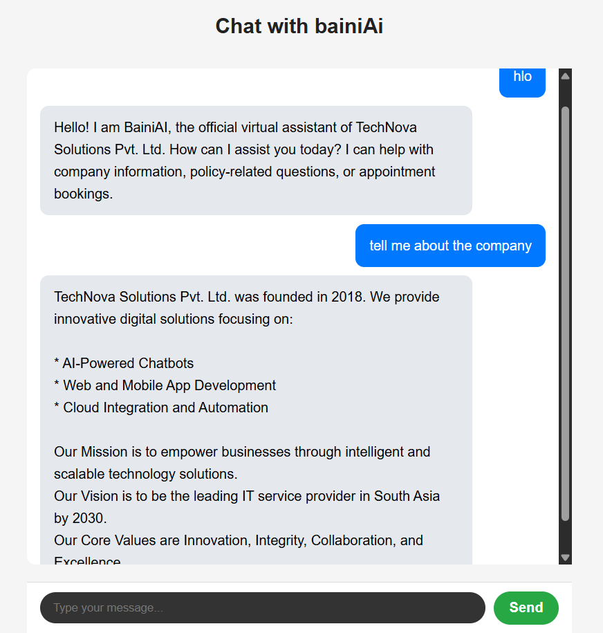
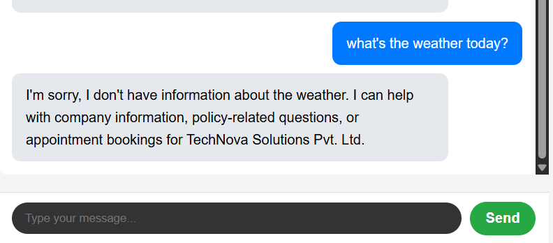
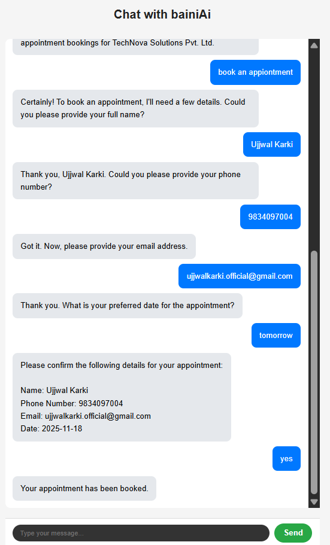
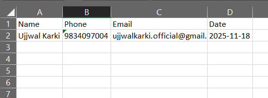

<h1>bainiAI — Company-Focused Chatbot with RAG, Gemini, and Appointment Booking</h1>

bainiAI is a specialized corporate assistant built using <strong>LangChain</strong>, <strong>RAG</strong>,
<strong>Gemini</strong>, <strong>FastAPI</strong>, and <strong>React (Vite)</strong>.  
It answers only company-related questions based on internal documents and can also 
<strong>book appointments through a natural, conversational flow</strong>.

<h2>Screenshots (Project Demonstration)</h2>

<strong>1. Chatbot answering a valid company-related question:</strong>

<strong>2. Chatbot declining unrelated questions:</strong>

<strong>3. Chatbot gathering appointment details (natural-language form):</strong>

<strong>4. Excel sheet showing successfully saved appointment:</strong>

<h2>Project Overview</h2>

bainiAI is trained on three internal documents:

<ul>
  <li>Company Overview</li>
  <li>IT Department Policies</li>
  <li>HR Policies</li>
</ul>

The chatbot responds strictly using these documents and declines anything unrelated.
It behaves like a disciplined digital employee: compliant, consistent, and aligned with the company.

<h2>Appointment Booking Feature</h2>

One of bainiAI’s most useful abilities is its <strong>conversational appointment booking system</strong>.
The chatbot can collect:

<ul>
  <li>Name</li>
  <li>Email</li>
  <li>Phone Number</li>
  <li>Appointment Date</li>
</ul>

<h3>Natural-Language Date Understanding</h3>

Users can speak naturally, and bainiAI will understand:

<ul>
  <li>“Next Monday”</li>
  <li>“Coming Thursday”</li>
  <li>“Book for tomorrow afternoon”</li>
  <li>“Schedule for this Friday”</li>
</ul>

bainiAI converts these into a proper <strong>YYYY-MM-DD</strong> format using date parsing logic.

<h3>Stored in Excel (Human-Friendly)</h3>

Appointments are saved to an Excel sheet rather than a database.  
This is intentional — the people managing appointments might not be technical, 
and Excel provides:

<ul>
  <li>Easy viewing</li>
  <li>No backend skills required</li>
  <li>Simple filtering and sorting</li>
  <li>A clean record of all bookings</li>
</ul>

This makes bainiAI practical and usable even for non-technical office environments.

<h2>Full-Stack Architecture</h2>

<h3>Frontend (Vite + React)</h3>
<ul>
  <li>Modern, fast development tooling</li>
  <li>Smooth chat interface</li>
  <li>Handles user input and displays bot responses</li>
</ul>

<h3>Backend (FastAPI + Uvicorn)</h3>
<ul>
  <li>Receives messages from frontend</li>
  <li>Passes queries to LangChain + Gemini</li>
  <li>Saves appointments to Excel</li>
  <li>Provides REST API endpoint for the chat</li>
</ul>

<h2>AI & Retrieval Pipeline (RAG)</h2>

<h3>1. Document Processing</h3>
<ul>
  <li>Document chunking</li>
  <li>Embeddings generation</li>
  <li>Chroma vector database storage</li>
</ul>

<h3>2. Retrieval</h3>
<ul>
  <li>User query → embedding</li>
  <li>Top-matching document chunks retrieved</li>
</ul>

<h3>3. Reasoning (Gemini + Prompts)</h3>
<ul>
  <li>Gemini receives context + strict instructions</li>
  <li>Answers only from documents</li>
  <li>Refuses irrelevant questions</li>
</ul>

<h3>4. Guardrails</h3>
<ul>
  <li>No hallucinations</li>
  <li>Domain-limited responses</li>
  <li>Consistent tone, formatting, and policy alignment</li>
</ul>

<h2>Architecture Diagram</h2>

<pre>
React Frontend (Vite)
        │
        ▼
FastAPI Backend (Uvicorn)
        │
        ▼
LangChain Retriever → Chroma Vector DB
        │
        ▼
Gemini LLM (Strict Prompts)
        │
        ▼
Company-Specific Answer
</pre>

<h2>Dockerization</h2>

bainiAI is fully containerized.  
Both frontend and backend have Dockerfiles, and the built images are pushed to Docker Hub.

<ul>
  <li>Frontend Docker container</li>
  <li>Backend Docker container</li>
  <li>Images available on Docker Hub</li>
</ul>

Deployment to AWS EC2 is planned, but currently paused due to instance slowness.

<h2>Example Valid Questions</h2>
<ul>
  <li>“What is our leave policy?”</li>
  <li>“Explain the onboarding rules from the IT department.”</li>
  <li>“Give me a summary of the company’s mission.”</li>
</ul>

<h2>Example Invalid Questions</h2>
<ul>
  <li>“Tell me a joke.”</li>
  <li>“Who is Einstein?”</li>
  <li>“What’s 27 × 49?”</li>
</ul>

bainiAI always declines politely.

<h2>Technologies Used</h2>
<ul>
  <li>React + Vite</li>
  <li>FastAPI + Uvicorn</li>
  <li>LangChain</li>
  <li>Google Gemini</li>
  <li>RAG Pipeline</li>
  <li>Chroma Vector DB</li>
  <li>Docker</li>
  <li>Excel for storing appointments</li>
</ul>

<h2>Future Enhancements</h2>
<ul>
  <li>Deploy with Nginx reverse proxy + HTTPS</li>
  <li>Add multi-step forms (multiple appointment types)</li>
  <li>Add role-based responses (HR / IT / Management)</li>
  <li>Analytics dashboard for appointment logs</li>
  <li>Vector database cloud hosting</li>
</ul>

<h2>License</h2>

This project is for educational and demonstration purposes.

